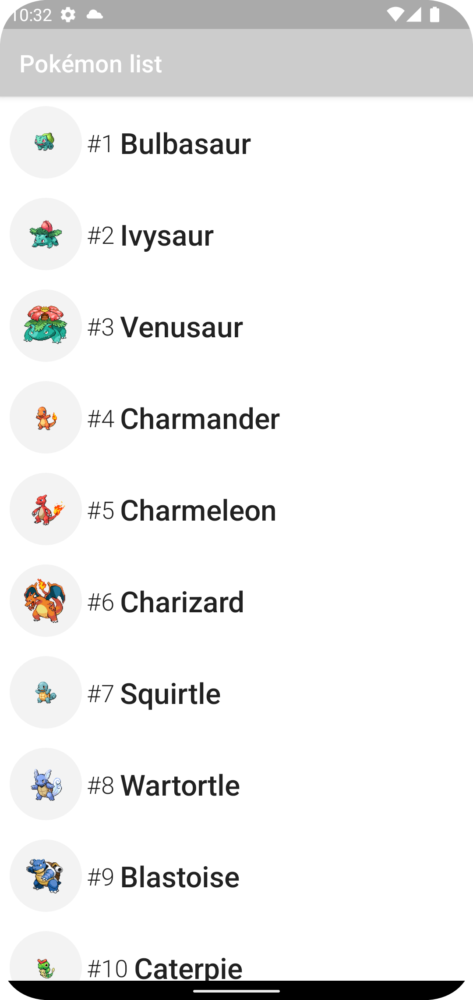

# Pokémon Jetpack Compose
## Ejemplo de App Android con Kotlin, Jetpack Compose, Retrofit y consumo de la API REST de Pokémon

* [Jetpack Compose](https://developer.android.com/jetpack/compose)
* [Retrofit](https://github.com/square/retrofit)
* [PokéAPI](https://pokeapi.co)

También tienes versión de esta aplicación en iOS

#### Puedes apoyar mi trabajo haciendo "☆ Star" en el repo o nominarme a "GitHub Star". ¡Gracias!

Si quieres unirte a nuestra comunidad de desarrollo, aprender programación de Apps, mejorar tus habilidades y ayudar a la continuidad del proyecto, puedes encontrarnos en:

##  Hola, mi nombre es Brais Moure.
### Freelance full-stack iOS & Android engineer

Soy ingeniero de software desde hace más de 12 años. Desde hace 4 años combino mi trabajo desarrollando Apps con creación de contenido formativo sobre programación y tecnología en diferentes redes sociales como **[@mouredev](https://moure.dev)**.

### En mi perfil de GitHub tienes más información

